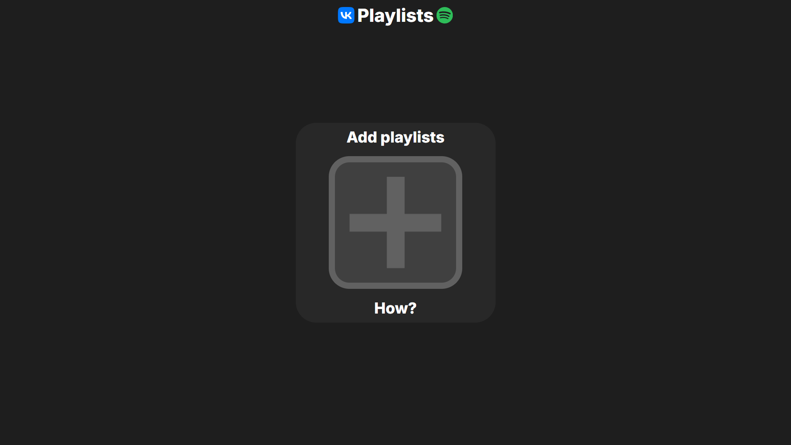
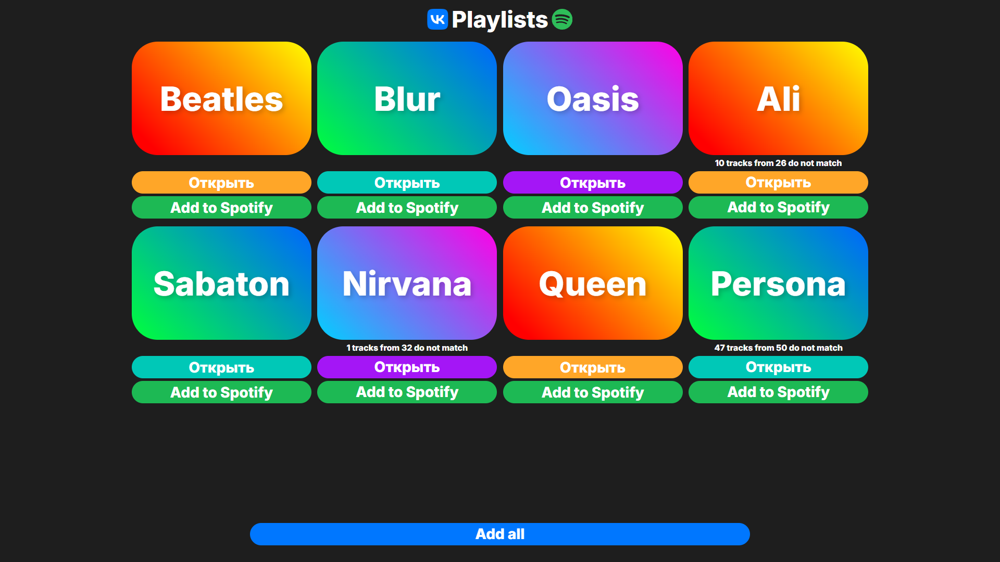
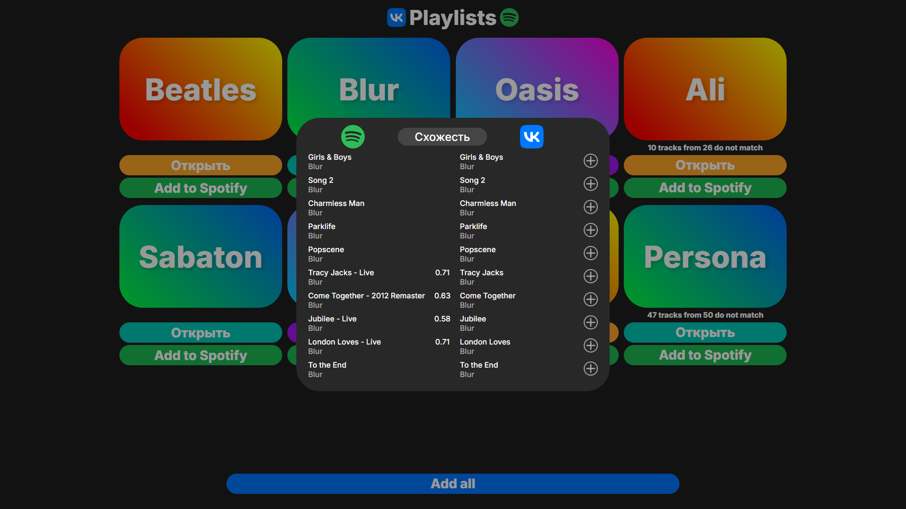
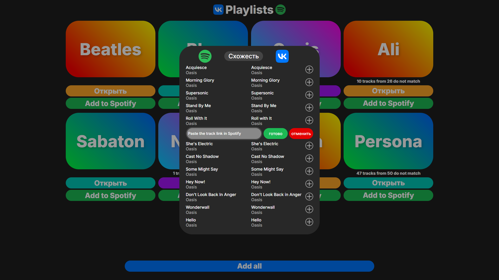
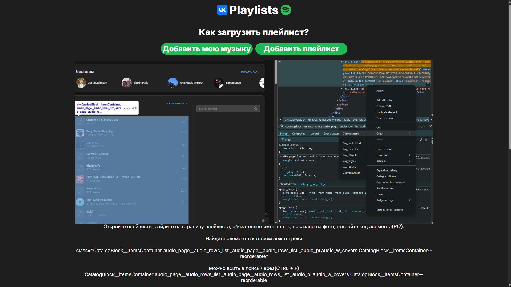
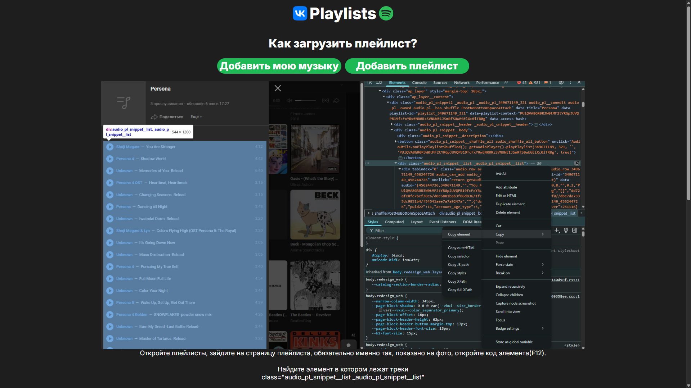
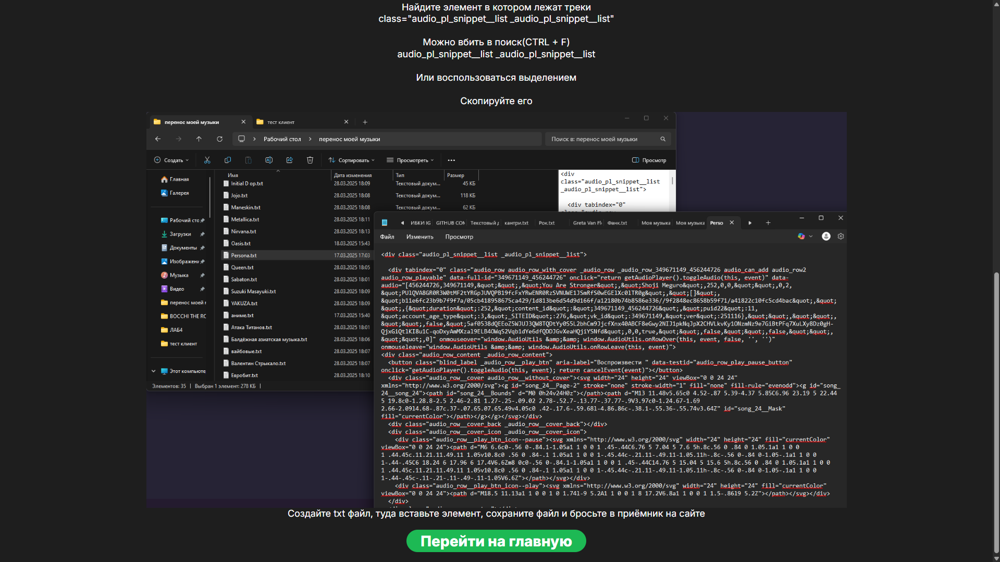

#  VKONTAKTE TO SPOTIFY 

*- Последнее обновление сайта было 4 апреля 2025 года*

#### Сайт - инструмент, созданный для переноса музыки из Вконтакте в Spotify. Простой и интуитивный интерфейс, красивый дизайн, быстрый перенос без ограничений. Использовался **Spotify API**

### Вступительная страница после авторизации. Поддерживает **Drag'n'Drop** и **Input**

### Плейлисты. Написал свой UiKit на **SCSS**

### Взаимодействие с плейлистом

### Загрузка плейлистов, как txt файлов

